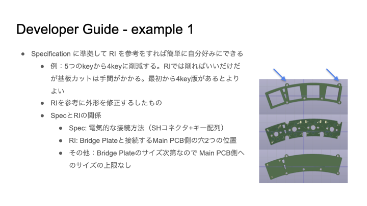
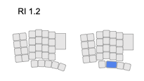

# Pangaea 開発者向けガイド 1.0

## はじめに

この文章は Panagea Keyboard の拡張可能な仕組みを利用して自分の好きなように親指や小指の部品を作る方法を紹介します。Pangaeaでは親指であれば標準で5キーが用意されており、自分でカットすることで4キーや3キーに削減できて、かつ位置を調整することができます。しかしカット自体が面倒ですし、加工時に怪我しやすいです。また親指で大きなキーを押したい、具体的には文字と同じサイズの1u ではなくて、倍の2uやちょっと大きい1.5uを使いたいという要望には答えることができません。そこでここでは親指の部品を修正する方法をご紹介します。
そういうことなら基板を作ってみようという方に KiCAD の使い方も紹介しますので比較的簡単に対応できるようになります。
「弘法筆を選ばす」と言われるように弘法大師のように書に優れている者なら筆の善し悪しは関係なく、つまり技量が優れていれば道具に左右されないという見方もありますが、そもそも手の大きさや動く範囲は人それぞれなので筆一本の世界とは異なると思っています。すなわち、人がキーボードに合わせるのか、キーボードを人に合わせるかというと、ここでは人に合わせてキーボードを修正するアプローチをとります。

## Concept of Pangaea Keyboard

[White Paper](whitepaper_jp.md) で実現したい世界が説明されているように Panagaea Keyboard では好きな部品を組み合わせて利用したり、PCB を切断することでキーの数を調整し、その位置を調整することができます。
欲しい部品がなければ共通部分を再設計することなく、必要な部分のみを設計し最小の工数で自分好みの keyboard を作ることができます。
このコンセプトを実現するために Specification を定義し、それに準拠した実装の例として Reference Implementaion (RI) が提供されます。いわゆるPangaea V1.2です。
この RI のKiCADによる設計ファイルはMITライセンスで配布されているため拡張部品を自由に開発し頒布したり販売したりすることができます。

## どんな変更や拡張ができるのか?

例えば直近では次のような部品の変更や拡張が考えられます。
まずは標準レイアウトから削る方向で見ると、数字行を省いたコンパクトなもの、メイン基板だけのマクロパッド的なものです。またメイン基板はチルトすることもできます。
将来は標準レイアウトに加えて、ファンクションキーや Joy Stick などの拡張も検討しています。
それぞれに対して仕様に準拠して互換性を考慮した作りをすれば新しい部分に集中できて開発の効率がよくなります。
これを実現するためにPangaeaではJST社のSHコネクタを採用しています。これにより簡単に部品を交換できるのです。Adafruit社のQwiccシステムでも利用されており、さまざまなケーブルも入手することができます。

INSERT JST-SHコネクタの写真

## Example 1： キーを減らした Thumb の特別仕様を作る

標準では 1u サイズのキーが5つ並んでおり、切断すれば4キー、あるいは3キーまで数を減らすことができます。しかしながらPCBの切断自体が面倒であり、RIは汎用性を持たせて設計しているため、切断するとネジ止めができなくなり少々強度が落ちます。ここでは専用部品としてキーの数を標準の5つから４つに減らした版を作ってみます。
個人的には左は5つほしいですが右は4つでいいし、5つあるとむしろ邪魔です。

### 完成のイメージ

図のような完成を目指します。Lower, Raiseの2つのキーとEnter部分に1.5uのサイズのキーを使えるように修正します。余談ですがもともとPangaeaを開發するまえはこのようなキーボードを利用していました。このような拡張ができることを想定して開発を進めてきました。

### 修正方針

配線とキーレイアウトの仕様はスペックで規定されています。ねじ穴は規定されておらず、RI 1.2の実装としてこのサイズになっています。今回はキーを削るだけですので特にスペックを見て確認するところはなく互換性の問題も生じません。

ここでは単純にキーを減らすだけですので次の方針で進めます。
* 親指部品の外形をできるだけ再利用し、キーを減らした枠を作る
* 親指部品の配線を再利用し、削減したキーのところだけ削除する
* 親指部品の2つのねじ穴を修正せず再利用する

### KiCADでの修正

大きく3つの変更で対応します。
トッププレート、PCB、ボトムプレートの3つを修正する必要があります。

1. KiCAD PCB editor にて一番右端のキーの footprint を削除
2. 続いて、一番右のキーに関連する配線を削除
3. ねじを利用するように edge の外形のデザインを変更

これで Gerberファイルを出力して基板を製造すれば、手間暇をかけて基板を切断したりする必要がなくなります。

### 完成形

ここまでは簡単です。

## Example 2： キーサイズを大きくした Thumb の特別仕様を作る

次はキーの削除といった簡単なものではなくて、キーのサイズを1uから少し大きくしてみます。

### ターゲット

できあがりのイメージです。
まず5つのキーから4つに減らします。そして、左から二番目のキーのサイズを1uから1.5uに変更します。

### 修正方針

まず1.5uにするには、キーの1.5uのfootprintが必要です。
さらに外形も配線も大きな修正が必要になります。

### KiCAD での修正

### 完成形

# Example 3: キーを追加する

