# Pangaea 開発者向けガイド 1.0

- [Pangaea 開発者向けガイド 1.0](#pangaea-開発者向けガイド-10)
  - [はじめに](#はじめに)
  - [コンセプト](#コンセプト)
  - [どんな変更や拡張ができるのか?](#どんな変更や拡張ができるのか)
  - [コンセプト実現の手段](#コンセプト実現の手段)
  - [Example 1： 4キーに減らした Thumb モジュールを作る](#example-1-4キーに減らした-thumb-モジュールを作る)
    - [完成のイメージ](#完成のイメージ)
    - [修正方針](#修正方針)
    - [KiCADでの修正](#kicadでの修正)
    - [PCB発注](#pcb発注)
    - [組み立て](#組み立て)
    - [ソフトウェア](#ソフトウェア)
    - [完成](#完成)
  - [Example 2： カーソルキーを足した Thumb モジュールを作る](#example-2-カーソルキーを足した-thumb-モジュールを作る)
    - [完成のイメージ](#完成のイメージ-1)
    - [修正方針](#修正方針-1)
    - [ソフトウェア](#ソフトウェア-1)
    - [KiCADでの修正](#kicadでの修正-1)
    - [PCB発注](#pcb発注-1)
    - [組み立て](#組み立て-1)
    - [完成](#完成-1)
  - [Example 3： 一部のキーサイズを大きくした Thumb モジュールを作る](#example-3-一部のキーサイズを大きくした-thumb-モジュールを作る)
    - [完成のイメージ](#完成のイメージ-2)
    - [修正方針](#修正方針-2)
    - [ソフトウェア](#ソフトウェア-2)
    - [KiCADでの修正](#kicadでの修正-2)
    - [PCB発注、組み立て、完成](#pcb発注組み立て完成)
  - [さらなる変形例](#さらなる変形例)

## はじめに

この開発者向けガイドでは Panagea Keyboard の拡張可能な仕組みを利用して自分の好きなように親指や小指の部品を作る方法を紹介します。
Pangaea の標準の親指モジュールでは5つのキーが用意されており、位置を調整することができるだけではなく、PCB を加工することでキーを4つや3つに削減することができます。しかしながらPCBの加工自体が面倒ですし加工時の怪我の可能性もありおすすめな方法でもありません。また親指で大きなキーを押したい、具体的には通常の文字と同じサイズの 1u ではなくて、2倍の2uサイズや少し大きい 1.5u のキーを使いたいという要望には答えることができませんが、拡張モジュールを作れば基本的に何でもできることになります。

ことわざで「弘法筆を選ばす」と言われるように書に優れている者なら筆の善し悪しは関係なく、つまり技量が優れていれば道具に左右されないという見方もありますが、そもそも手の大きさや動く範囲は人それぞれに異なるので筆一本の世界とは異なると思います。すなわち、ここでは道具であるキーボードを修正するアプローチをとります。

## コンセプト

[White Paper](whitepaper_jp.md) で実現したい世界が説明されているように Panagaea Keyboard では、キーの物理的な位置を調整することができるだけではなく、好きな部品を組み合わせて利用することができます。
共通部分となるメインモジュールやマイコンの配線を再設計することなく、変更が必要な親指や小指の部分のみを設計し、最小の工数で自分好みの keyboard を作ることができるようになっています。

## どんな変更や拡張ができるのか?

例えば次のような部品の変更や拡張が考えられます。
まずは Reference Implementation (RI) では、親指モジュールと小指モジュールを省いたメインモジュールだけのマクロパッドも作れます。標準レイアウトからの小さな変更では、ロータリエンコードの省略、ロータリーエンコーダの隣のキーを削除できます。また大きな変更では基板をカットすることで数字行を省いてサイズを小さくすることできます。この標準レイアウトに加えて、ファンクションキーや Joy Stick などの拡張部品も作れるわけです。
またSU120を用いてキーの追加なども可能です。ネジ止め用の穴が基板に空いていますのでSU120のジョイントを用いて接続できます。

仕様に準拠して互換性を考慮した作りをすることで、新しい部分に集中できて開発の効率がよくなります。
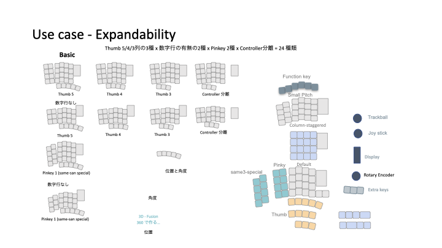

## コンセプト実現の手段

このコンセプトを実現するために仕様(Pangaea Specification) が規定されており、仕様に準拠した実装の例として Reference Implementaion (RI) があります。それが Pangaea keyboard V1.2 です。
つまり、仕様に準拠したRI1.2とは別の keyboard の実装もあり得えるわけです。例えば左右を分離しない一体型やカスタマイズした親指モジュール、または独自の調整機構を持ってもよいわけです。
仕様を決める利点として、RI でも別の keyboard でもコネクタでつなぐだけで相互でモジュールを利用できます。

まず Pangaea RI 1.2でできるカスタマイズの一覧です。
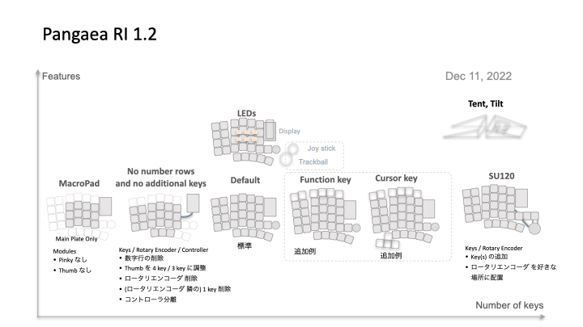

ここのカスタマイズでは例えば親指モジュールのキーの数を減らすことができます。ただし、PCBを削るという工作が必要になります。
簡単にできることとしては、モジュールの交換や一部機能の削除です。小指モジュールをSameスペシャルにする、Rotaty Encoderを削除する、キーを一つ削除などがあります。

これで満足できず、新たな部品を作りたい方向けにここから詳しく説明します。具体的には、親指モジュールのキーの数を削減した専用基板やカーソルキーを加えた専用基板などです。
この RI の KiCAD による親指モジュールなどの設計ファイルは MITライセンスで配布されているため拡張部品を自由に開発し頒布や販売ができます。

各文章の位置づけは次の図のようになります。
まず実現したい世界を描いた White Paper ではコンセプトを紹介しています。次に Use Case ではコンセプトに沿って具体的にどんなオプションの部品を作ることができるのかをあげています。仕様(Specification) ではモジュール間の接続とソフトウェアの後方互換性を維持するためにメカや電気信号の規定がされています。そして、本稿、開発者けガイド(Developer Guide) では拡張部品を開発してみようという方向けに互換性を維持しつつ、必要なところだけを開発できる仕組みをご紹介します。

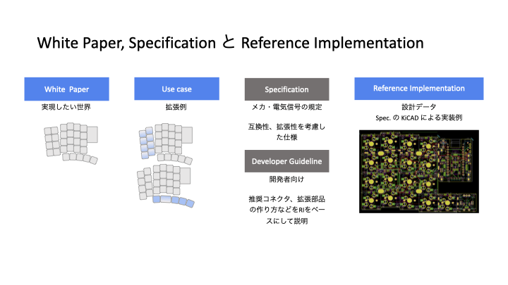

モジュール間の接続や交換を簡単にするためにモジュール間の接続に JST 社の SH コネクタを採用しています。Sparckfun 社の Qwicc システムでも利用されてコネクタで、さまざまな長さのケーブルを入手することができます。日本では例えば秋月電子さんがコネクタやケーブルを取り扱っています。

JST SHコネクタ
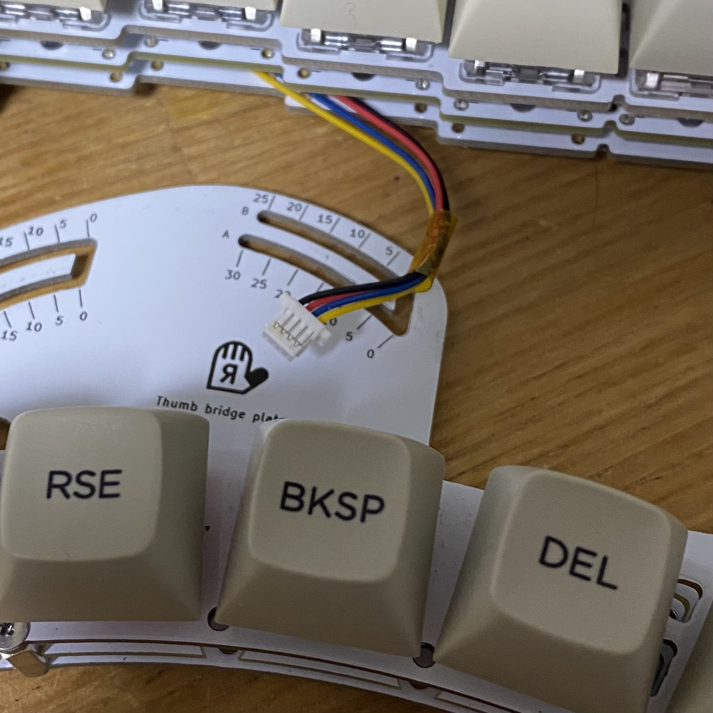

それでは、いくつか例を示しながら、Pangaeaスペック、RIの関係を見ていきます。

## Example 1： 4キーに減らした Thumb モジュールを作る

標準では 1u サイズのキーが5つ並んでおり、切断すれば4キーあるいは3キーまで数を減らすことができます。しかしながら PCBの切断の作業自体が面倒であり、RIは汎用性を持たせて設計しているため、切断すると一部ネジ止めができなくなり少々強度が落ちます。ここでは専用部品としてキーの数を標準の5つから４つに減らした版を作る例を紹介します。個人的には左は5キーが欲しいのですが、右は4キーで十分で、かつ利用しないキーが指にあたり邪魔に感じることがあります。

### 完成のイメージ

図の左が標準です。図の右が作ろうとしているモジュールです。一番右端のキーを削除することにします。

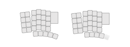

### 修正方針

今回はキーを削るだけですのでPangaea仕様の確認は不要です。仕様を見て確認するところはなく互換性の問題も生じないためです。
通常、PCBを作るには回路図を作成し部品に応じたフットプリントを指定して、部品同士を配線するという流れになります。
ここでは、すでに標準部品からの部品の削除だけなので、回路図とフットプリントの部分は省くことができます。修正は次の方針で進めてみます。

* 親指部品の外形をできるだけ再利用し、キーを減らした外枠を作る
* 親指部品の配線を利用し、削減したキーのところだけ削除する
* 親指部品のモジュール間をつなぐための2つのねじ穴を再利用する

Pangaea仕様では電気配線および論理的なキーレイアウトが規定されています。また図の青い矢印で示されたモジュール間を接続するねじ穴の位置はPangaea仕様では規定されておらず、RI 1.2の実装として規定されたサイズになっています。

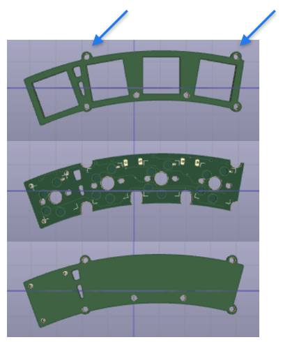

### KiCADでの修正

親指モジュールはトッププレート、PCB、ボトムプレートの3つを修正する必要があります。
作業の順番としては、まずトッププレートで外形サイズを決めて、それに合わせてPCBとボトムプレートを修正していくのが効率がよいと思います。

トッププレートの修正
1. KiCAD PCB editor にて一番右端のキーの footprint を削除する
2. 外形のデザインを変更するために Edge CutのLayerを修正する
   1. サイズをキー4つ分に修正する
   2. 右端の手前でもねじを利用できるようにネジ穴を追加する
3. 一番右のキーに関連する配線を削除する

これで Gerberファイルを出力して基板を製造すれば、基板を切断する手間がなくなります。

### PCB発注

KiCADでGerber ファイルを生成し、お好きな基板の製造会社に発注し、届くのを待ちます。
最近はJLCPCB社を多く利用しています。費用はPCB5枚なら数ドルで配送方法に早い配送サービスを使わずOCSなら送料を含めても安価に作ることができます。

### 組み立て

完成した親指モジュールとメインモジュールをSHコネクタのケーブルで接続して動作を確認します。

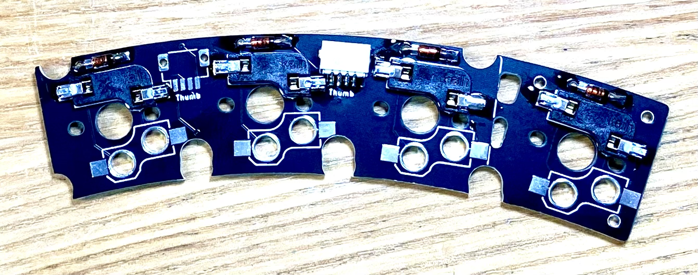
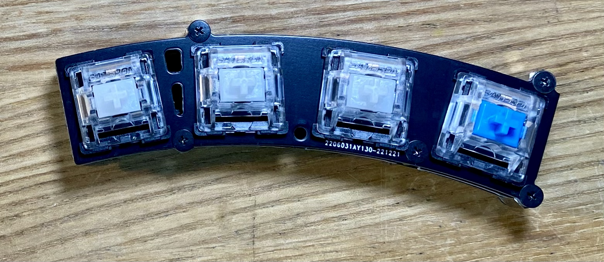

### ソフトウェア

QMK でXXXXXXとXが7個連続しているところはなにもキーが割り当てられていないということを示します。
キーを一つ削除しただけですのでソフトウェアの変更は不要ですが、削除した場所を確認し、一つキーがずれるなんてことがないようにします。
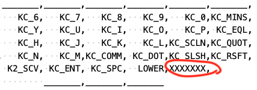

### 完成

組み立てるとこのようになりました。
この例では親指モジュールのキー数を減らす修正しました。
このように自分が修正したい部分だけを作ればより手に合わせることができるようになります。

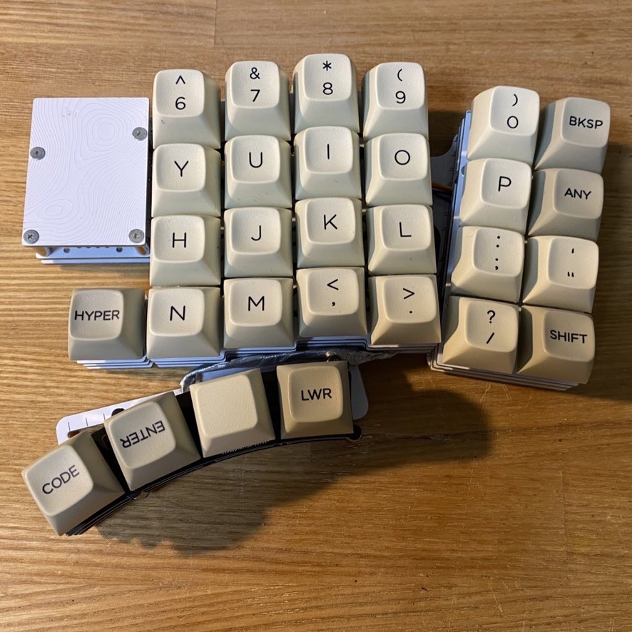

## Example 2： カーソルキーを足した Thumb モジュールを作る

次はキーを削るのではなくて、カーソルキーを加えた例を紹介します。

### 完成のイメージ

図のような完成を目指します。
カーソル部分の角度はSU120で組んで試してみた結果です。
Pangaea RI 1.2では円弧を描くように動かせますので多少の角度なら調整できることになります。

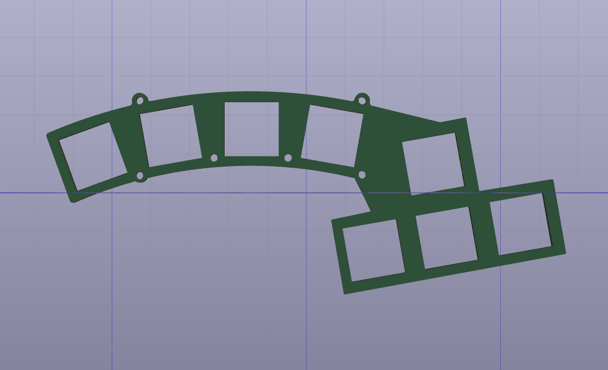

### 修正方針

親指モジュールは5つのキーがありますが、実は3キーを追加できる配列になっています。その一番右のキーとこの3キーを利用して、合計4キーを矢印キーに割り当てることにします。

### ソフトウェア

図はqmk用のfirmwareのpangaea.hからの抜粋です。
右下にあるように標準では利用されていないR36,R39,R40の3つを矢印キーに割り当てます。

キーの割当
* R35: 上
* R36: 左
* R39: 下
* R40: 右

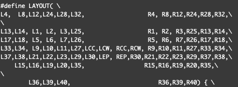

元の親指モジュールの左から4つのキーの配置です。
SW15, SW16, SW19, SW20の4つです。
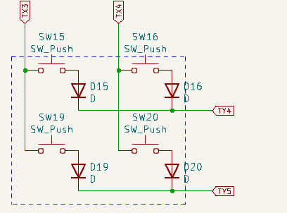

追加分の矢印部分と元の親指モジュールの右から一つ目のキーの配置です。SW35,36,39,40です。この2つは一見すると同じ回路図に見えるかもしれませんが、ダイオードの向きが逆になっていますのでそれぞれを判定することができます。
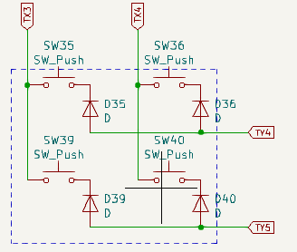

トータルでは、新規の親指モジュールは下記のような配列になります。
R15,R16,R19,R20,R35
            R36,R39,R40

### KiCADでの修正

先程の外形に合わせてKiCADで配線していきます。
Pangaea RI の回路図から該当部分をコピーして、footprintを更新し、配置します。外形を標準のThumbモジュールからコピーして拡張部分を加えます。あとはfreerouterを用いて配線するだけです。
標準モジュールでは2つのSHコネクタが配線されていますが、一つだけにしても大丈夫です。

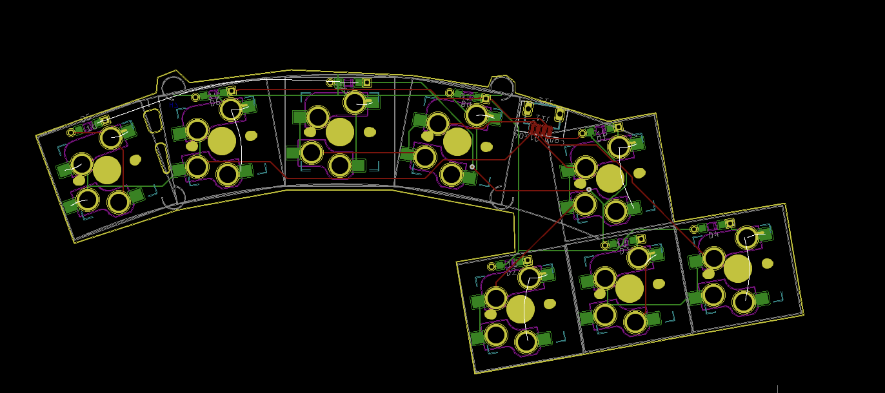
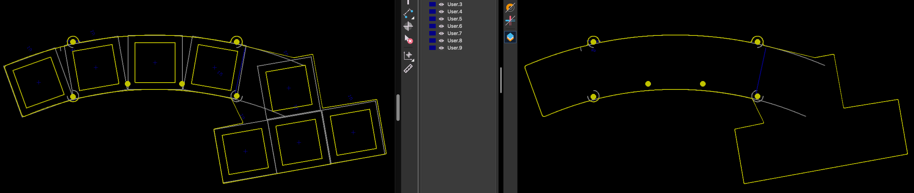

### PCB発注

詳細は省略します。Gerberファイルを生成して発注します。

### 組み立て

詳細は省略します。

### 完成

KiCADをちょっと操作するだけであっという間に自分だけのキーボードができてしまいます。名実ともに自作キーボードと言えるのではないでしょうか。

## Example 3： 一部のキーサイズを大きくした Thumb モジュールを作る

次はキーの削除といった簡単なものではなくて、キーのサイズを1uから少し大きくして1.5uや2uサイズを使うように変更してみます。
具体的にはLower, Raiseの2つのキーとEnter部分に1.5uのサイズのキーを使えるように修正します。余談ですがもともとPangaeaを開発する前このような親指の一部のキーのサイズが大きいキーボードを利用していました。このような拡張ができることを想定して開発しています。

### 完成のイメージ

できあがりのイメージです。
まず5つのキーから4つに減らします。そして、左から二番目のキーのサイズを1uから1.5uに変更します。

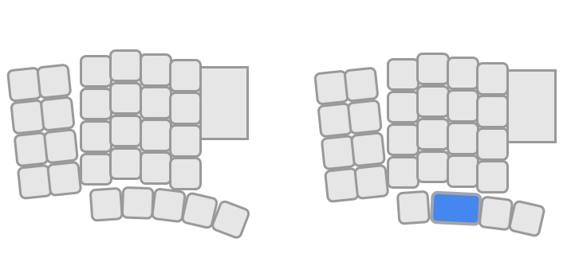

### 修正方針

これまでの例1と例2を組み合わせればできる内容です。
外形を整えて、配線をして終わりですが、例１との違いは配線がやり直しになりますので回路図を用意してすすめると効率的になります。

### ソフトウェア

右端を削るのか、左端を削るのかを決めて修正すればよいだけです。

### KiCADでの修正

1.5uにするには、キーの1.5uのfootprintが必要です。
さらに外形も配線も大きな修正が必要になります。

### PCB発注、組み立て、完成

省略します。

## さらなる変形例

ここまで作ることができれば、図にしめすようないろいろな変形例が作れるようになっていると思います。
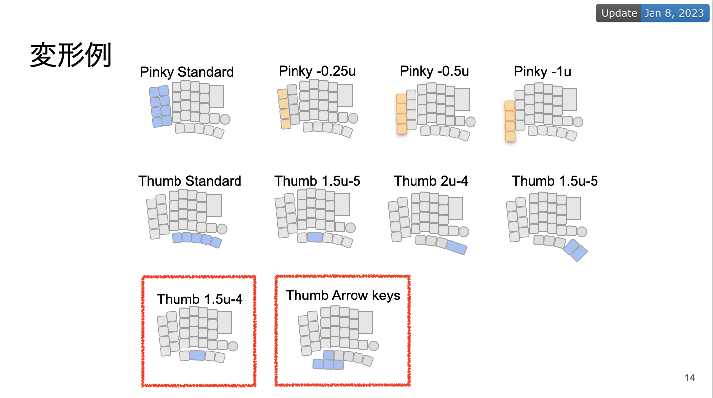

部分的にカスタマイズすることで手間もコストも抑えて自分好みのキーボードを作ることができます。

