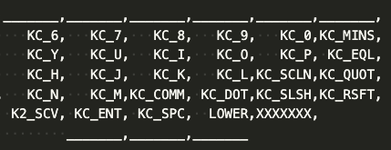

# Pangaea 開発者向けガイド 1.0

- [Pangaea 開発者向けガイド 1.0](#pangaea-開発者向けガイド-10)
  - [はじめに](#はじめに)
  - [コンセプト](#コンセプト)
  - [どんな変更や拡張ができるのか?](#どんな変更や拡張ができるのか)
  - [コンセプト実現の手段](#コンセプト実現の手段)
  - [Example 1： 4キーに減らした Thumb モジュールを作る](#example-1-4キーに減らした-thumb-モジュールを作る)
    - [完成のイメージ](#完成のイメージ)
    - [修正方針](#修正方針)
    - [KiCADでの修正](#kicadでの修正)
    - [PCB発注](#pcb発注)
    - [組み立て](#組み立て)
    - [ソフトウェア](#ソフトウェア)
    - [完成形](#完成形)
  - [Example 2： カーソルキーを足した Thumb モジュールを作る](#example-2-カーソルキーを足した-thumb-モジュールを作る)
    - [ターゲット](#ターゲット)
    - [修正方針](#修正方針-1)
    - [KiCAD での修正](#kicad-での修正)
    - [QMK用firmwareの修正](#qmk用firmwareの修正)
    - [完成形](#完成形-1)
  - [Example 3： 一部のキーサイズを大きくした Thumb モジュールを作る](#example-3-一部のキーサイズを大きくした-thumb-モジュールを作る)
    - [ターゲット](#ターゲット-1)
    - [修正方針](#修正方針-2)
    - [KiCAD での修正](#kicad-での修正-1)
    - [完成形](#完成形-2)

## はじめに

この開発者向けガイドでは Panagea Keyboard の拡張可能な仕組みを利用して自分の好きなように親指や小指の部品を作る方法を紹介します。
Pangaea の標準の親指モジュールでは5つのキーが用意されており、位置を調整することができるだけではなく、PCB を加工することでキーを4つや3つに削減することができます。しかしながらPCBの加工自体が面倒ですし加工時の怪我の可能性もありおすすめな方法でもありません。また親指で大きなキーを押したい、具体的には通常の文字と同じサイズの 1u ではなくて、2倍の2uサイズや少し大きい 1.5u のキーを使いたいという要望には答えることができませんが、拡張モジュールを作れば基本的に何でもできることになります。

ことわざで「弘法筆を選ばす」と言われるように書に優れている者なら筆の善し悪しは関係なく、つまり技量が優れていれば道具に左右されないという見方もありますが、そもそも手の大きさや動く範囲は人それぞれに異なるので筆一本の世界とは異なると思います。すなわち、ここでは道具であるキーボードを修正するアプローチをとります。

## コンセプト

[White Paper](whitepaper_jp.md) で実現したい世界が説明されているように Panagaea Keyboard では、キーの物理的な位置を調整することができるだけではなく、好きな部品を組み合わせて利用することができます。
共通部分となるメインモジュールやマイコンの配線を再設計することなく、変更が必要な親指や小指の部分のみを設計し、最小の工数で自分好みの keyboard を作るようになっています。

## どんな変更や拡張ができるのか?

例えば次のような部品の変更や拡張が考えられます。
まずは Reference Implementation (RI) では、親指モジュールと小指モジュールを省いたメインモジュールだけのマクロパッドも作れます。標準レイアウトからの小さな変更では、ロータリエンコードの省略、ロータリーエンコーダの隣のキーを削除できます。また大きな変更では基板をカットすることで数字行を省いてサイズを小さくすることできます。この標準レイアウトに加えて、ファンクションキーや Joy Stick などの拡張部品も作れるわけです。
仕様に準拠して互換性を考慮した作りをすることで、新しい部分に集中できて開発の効率がよくなります。

## コンセプト実現の手段

このコンセプトを実現するために仕様(Specification) が規定されており、仕様に準拠した実装の例として Reference Implementaion (RI) があります。それが Pangaea keyboard V1.2 です。
つまり、仕様に準拠した別の keyboardの実装もあり得えるわけです。例えば左右を分離しない一体型やカスタマイズした親指モジュール、または独自の調整機構を持ってもよいわけです。
仕様を決める利点として、RI でも別の keyboard でも相互で親指モジュールを再利用することができます。

まず Pangaea RI 1.2でできるカスタマイズの一覧です。

これで満足できず、新たな部品を作りたい方向けにここから詳しく説明します。具体的には、親指モジュールのキーの数を削減する、小指モジュールをSameスペシャルにする、Rotaty Encoderを削除する、キーを一つ削除などです。
この RI の KiCAD による親指モジュールなどの設計ファイルは MITライセンスで配布されているため拡張部品を自由に開発し頒布や販売ができます。

各文章の位置づけは次の図のようになります。
まず実現したい世界を描いた White Paper ではコンセプトを紹介しています。次に Use Case ではコンセプトに沿って具体的にどんなオプションの部品を作ることができるのかをあげています。仕様(Specification) ではモジュール間の接続とソフトウェアの後方互換性を維持するためにメカや電気信号の規定がされています。そして、本稿、開発者けガイド(Developer Guide) では拡張部品を開発してみようという方向けに互換性を維持しつつ、必要なところだけを開発できる仕組みをご紹介します。

モジュール間の接続や交換を簡単にするためにモジュール間の接続に JST 社の SH コネクタを採用しています。Sparckfun 社の Qwicc システムでも利用されてコネクタで、さまざまな長さのケーブルを入手することができます。日本では例えば秋月電子さんがコネクタやケーブルを取り扱っています。

JST SHコネクタ

それでは、いくつか例を示しながら、Pangaeaスペック、RIの関係を見ていきます。

## Example 1： 4キーに減らした Thumb モジュールを作る

標準では 1u サイズのキーが5つ並んでおり、切断すれば4キー、あるいは3キーまで数を減らすことができます。しかしながら PCBの切断の作業自体が面倒であり、RIは汎用性を持たせて設計しているため、切断するとネジ止めができなくなり少々強度が落ちます。ここでは専用部品としてキーの数を標準の5つから４つに減らした版を作ってみます。
個人的には左は5キーが欲しいのですが、右は4つでよく、むしろ5つもキーがあると利用しないキーが指にあたり邪魔に感じることがあります。

### 完成のイメージ

図の左が標準です。図の右が作ろうとしているモジュールです。一番右端のキーを削除することにします。

### 修正方針

電気配線とキーレイアウトの仕様は規定されています。
図の青い矢印で示されたモジュール間を接続するねじ穴の位置はPangaea仕様では規定されておらず、あくまで RI 1.2の実装としてこのサイズになっています。
今回はキーを削るだけですので特に仕様を見て確認するところはなく互換性の問題も生じませんので
仕様の確認は不要のため次の方針で進めます。

* 親指部品の外形をできるだけ再利用し、キーを減らした枠を作る
* 親指部品の配線を再利用し、削減したキーのところだけ削除する
* 親指部品の2つのねじ穴を修正せずそのまま再利用する

### KiCADでの修正

親指モジュールは、トッププレート、PCB、ボトムプレートの3つを修正する必要があります。
作業の順番としては、まずトッププレートで外形のサイズを決めて、それに合わせてPCBとボトムプレートを修正していくのがよいと思います。

トッププレートの修正
1. KiCAD PCB editor にて一番右端のキーの footprint を削除する
2. Edge Cutを修正し、サイズをキー4つ分に修正する
3. 右端の手前でもねじを利用できるように Edge Cut の外形のデザインを変更する
4. 一番右のキーに関連する配線を削除する

これで Gerberファイルを出力して基板を製造すれば、手間暇をかけて基板を切断したりする必要がなくなります。

### PCB発注

KiCADでGerberを生成し、お好きな基板の製造会社に発注し、届くのを待ちます。

### 組み立て

完成した親指モジュールとメインモジュールをSHコネクタのケーブルで接続して動作を確認します。

### ソフトウェア

QMK でXXXXXXとXが7個連続しているところはなにもキーが割り当てられていないということを示します。
キーを一つ削除しただけですのでソフトウェアの変更は不要ですが、削除した場所を確認し、一つキーがずれるなんてことがないようにします。

### 完成形

組み立てるとこのようになりました。  
この例では親指モジュールのキー数を減らす修正しました。
このように自分が修正したい部分だけを作ればより手に合わせることができるようになります。

## Example 2： カーソルキーを足した Thumb モジュールを作る

次はキーを削るのではなくて、キーを足す例をご紹介します。

### ターゲット

### 修正方針

### KiCAD での修正

### QMK用firmwareの修正
### 完成形
図のような完成を目指します。Lower, Raiseの2つのキーとEnter部分に1.5uのサイズのキーを使えるように修正します。余談ですがもともとPangaeaを開発する前このような親指の一部のキーのサイズが大きいキーボードを利用していました。このような拡張ができることを想定して開発しています。

## Example 3： 一部のキーサイズを大きくした Thumb モジュールを作る

次はキーの削除といった簡単なものではなくて、キーのサイズを1uから少し大きくしてみます。

### ターゲット

できあがりのイメージです。
まず5つのキーから4つに減らします。そして、左から二番目のキーのサイズを1uから1.5uに変更します。

### 修正方針

まず1.5uにするには、キーの1.5uのfootprintが必要です。
さらに外形も配線も大きな修正が必要になります。

### KiCAD での修正

### 完成形

